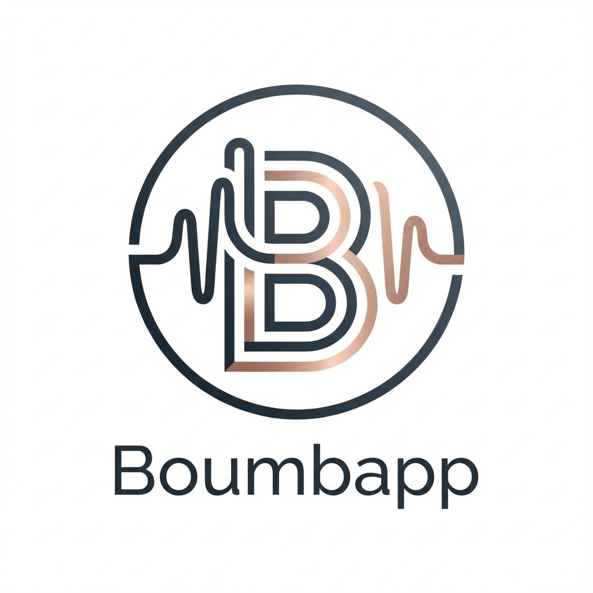

# 🎵 Boumb'App - Cloud Music Studio

<div align="right">
  <a href="#-boumbapp---studio-musical-cloud">🇫🇷 Version Française</a>
</div>

**Boumb'App** is a modern, web-based DAW (Digital Audio Workstation) that brings music production to the cloud. Built with a Cyberpunk aesthetic and powerful audio features, it offers a complete suite of tools for beatmakers and producers.



## 🚀 Features

### 🎹 The Studio Modules
*   **Juicy Box (Drum Machine)**: 32-step sequencer with drag-and-drop sample management.
*   **Synth Lab**: Dual-oscillator synthesizer (Lead & Bass) with built-in **AI Composer** for generative melodies.
*   **Skyline (Arrangement)**: Timeline view to structure your tracks from loops to full songs. "Matrix-style" debug overlay included.
*   **The Sauce (Mixer)**: Professional mixing console with Glassmorphism UI and effects chain (Reverb, Delay, BitCrusher, AutoFilter).

### ☁️ Cloud & Connectivity
*   **Unified Dashboard**: Personal space to manage your producer identity and project library.
*   **Cloud Save**: Automatic versioning and persisting of your projects.
*   **Global Key**: Intelligent musical key synchronization across all modules.

## 🛠️ Tech Stack

*   **Frontend**: React (Vite), TypeScript, Tone.js, Zustand, SCSS (Modules).
*   **Backend**: Symfony (PHP), API Platform, PostgreSQL.
*   **AI Service**: Python (FastAPI), Magenta (TensorFlow) for generative audio.
*   **Infrastructure**: Docker, Docker Compose, Caddy (Reverse Proxy).

## 📦 Installation

### Prerequisites
*   Docker & Docker Compose
*   Node.js 18+ (for local frontend dev)

### Quick Start

1.  Clone the repository:
    ```bash
    git clone https://github.com/RobNamias/BoumbApp.git
    cd BoumbApp
    ```

2.  Start the stack with Docker:
    ```bash
    docker compose up -d --build
    ```

3.  Access the application:
    *   **App**: [https://localhost](https://localhost)
    *   **API**: [https://localhost/api](https://localhost/api)

## 📖 Documentation

A comprehensive User Manual is available directly within the application (click the book icon) or in `client/public/manual`.
*   [French Documentation](client/public/manual/fr/index.html)
*   [English Documentation](client/public/manual/en/index.html)


---

# 🇫🇷 Boumb'App - Studio Musical Cloud

**Boumb'App** est un DAW (Digital Audio Workstation) moderne et web-based qui porte la production musicale dans le cloud. Construit avec une esthétique Cyberpunk et des fonctionnalités audio puissantes, il offre une suite complète d'outils pour les beatmakers et producteurs.

## 🚀 Fonctionnalités

### 🎹 Les Modules Studio
*   **Juicy Box (Boîte à Rythmes)** : Séquenceur 32 pas avec gestion des samples par glisser-déposer.
*   **Synth Lab** : Synthétiseur à deux oscillateurs (Lead & Bass) avec **Compositeur IA** intégré pour générer des mélodies.
*   **Skyline (Arrangement)** : Vue Timeline pour structurer vos morceaux, du loop à la chanson complète. Monitoring "Matrix-style" inclus.
*   **The Sauce (Mixage)** : Console de mixage professionnelle avec interface "Glassmorphism" et chaîne d'effets (Reverb, Delay, BitCrusher, AutoFilter).

### ☁️ Cloud & Connectivité
*   **Dashboard Unifié** : Espace personnel pour gérer votre identité de producteur et votre bibliothèque de projets.
*   **Sauvegarde Cloud** : Versioning automatique et persistance de vos projets.
*   **Global Key** : Synchronisation intelligente de la tonalité musicale à travers tous les modules.

## 🛠️ Stack Technique

*   **Frontend**: React (Vite), TypeScript, Tone.js, Zustand, SCSS (Modules).
*   **Backend**: Symfony (PHP), API Platform, PostgreSQL.
*   **Service IA**: Python (FastAPI), Magenta (TensorFlow) pour l'audio génératif.
*   **Infrastructure**: Docker, Docker Compose, Caddy (Reverse Proxy).

## 📦 Installation

### Prérequis
*   Docker & Docker Compose
*   Node.js 18+ (pour le dev frontend local)

### Démarrage Rapide

1.  Cloner le dépôt :
    ```bash
    git clone https://github.com/RobNamias/BoumbApp.git
    cd BoumbApp
    ```

2.  Lancer la stack avec Docker :
    ```bash
    docker compose up -d --build
    ```

3.  Accéder à l'application :
    *   **App**: [https://localhost](https://localhost)
    *   **API**: [https://localhost/api](https://localhost/api)

## 📖 Documentation

Un Manuel Utilisateur complet est disponible directement dans l'application (cliquez sur l'icône de livre) ou dans `client/public/manual`.
*   [Documentation Française](client/public/manual/fr/index.html)
*   [Documentation Anglaise](client/public/manual/en/index.html)

---

*Made with ❤️ and code by RobNamias feat Gemini.*
