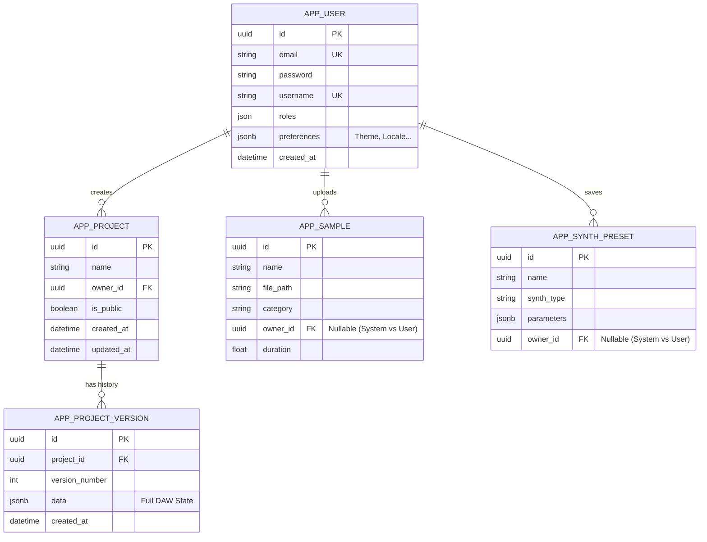

# Modèle Conceptuel de Données (MVP)

Ce document présente la structure visuelle de la base de données pour le MVP.

## 1. Diagramme (Mermaid)
Ce diagramme est généré automatiquement par GitHub/GitLab et la plupart des éditeurs Markdown.



## 2. Code DBML (Pour outils externes)
Vous pouvez copier-coller ce code sur [dbdiagram.io](https://dbdiagram.io/) pour une visualisation interactive.

```dbml
Table app_user {
  id uuid [pk]
  email varchar [unique, not null]
  password varchar [not null]
  username varchar [unique, not null]
  roles json [not null]
  preferences jsonb
  created_at datetime [not null]
  updated_at datetime
}

Table app_project {
  id uuid [pk]
  name varchar [not null]
  owner_id uuid [ref: > app_user.id]
  is_public boolean [default: false]
  created_at datetime [not null]
  updated_at datetime
}

Table app_project_version {
  id uuid [pk]
  project_id uuid [ref: > app_project.id]
  version_number int [not null]
  data jsonb [note: "Full DAW State (Tracks, Notes, Mixer)"]
  created_at datetime [not null]
}

Table app_sample {
  id uuid [pk]
  name varchar [not null]
  file_path varchar [not null]
  category varchar [not null]
  owner_id uuid [ref: > app_user.id, note: "Nullable: Global if null"]
  duration float
  created_at datetime
}

Table app_synth_preset {
  id uuid [pk]
  name varchar [not null]
  synth_type varchar [not null]
  parameters jsonb [not null]
  owner_id uuid [ref: > app_user.id, note: "Nullable: Global if null"]
}
```
