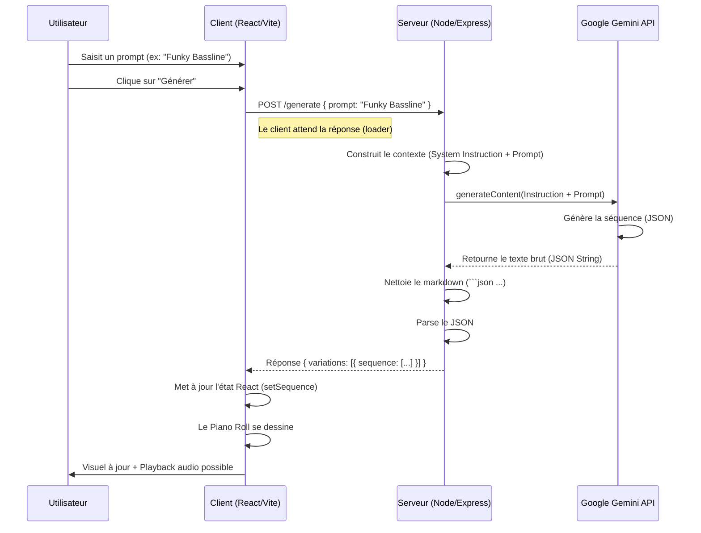

# Rapport de Fin de POC : Intégration IA Générative Musicale

## 1. Objectif du POC
Démontrer la faisabilité technique d'une génération de mélodies MIDI assistée par IA (Google Gemini) au sein d'une interface web interactive (Piano Roll), avec un flux de données fluide entre le client et une API externe.

---

## 2. Spécifications Techniques

### Backend (`/server`)
*   **Runtime** : Node.js
*   **Framework** : Express.js
*   **Langage** : JavaScript (ES Modules)
*   **Dépendances Clés** :
    *   `@google/generative-ai` : SDK officiel pour l'API Gemini.
    *   `cors` : Gestion des requêtes Cross-Origin (essentiel pour le dev local).
    *   `body-parser` : Parsing des requêtes JSON entrantes.
*   **Modèle IA** : `gemini-2.0-flash` (Optimisé pour la vitesse et la créativité).

### Frontend (`/client`)
*   **Build Tool** : Vite
*   **Framework** : React
*   **Moteur Audio** : Tone.js (Synthétiseur PolySynth, Transport, Loop).
*   **Composants UI** :
    *   **Piano Roll** : Grille CSS interactive de 64 pas (4 mesures) sur 4 octaves (C2-B5).
    *   **Contrôles** : BPM (Transport), ADSR (Synthé), Prompt IA (Textarea).
*   **Style** : CSS Pur (Variables CSS, Flexbox, Grid), Design fluide "néon/sombre".

### Infrastructure
*   **Docker** : Conteneurisation des services Client et Serveur via `docker-compose.yml`.
*   **Réseau** : Communication Client <-> Serveur via HTTP (Port 3000 mapping).

---

## 3. Flux de Données (Data Flow)



---

## 4. Prompt Système (The "Secret Sauce")

Voici l'instruction système exacte utilisée pour garantir des résultats musicaux cohérents et variés :

```javascript
const SYSTEM_INSTRUCTION = `
You are a professional music composer and synthesizer sequencer.
Your task is to generate short musical melodies (loops) based on user descriptions.

OUTPUT FORMAT:
You must return ONLY a raw JSON object. Do not include markdown formatting (no \`\`\`json or \`\`\`).
The JSON must follow this exact schema:
{
  "sequence": [
    {
      "note": "NoteNameOctave" (e.g., "C4", "F#3"),
      "time": "Bar:Beat:Sixteenth" (e.g., "0:0:0", "0:0:2", "0:1:0"),
      "duration": "Duration" (e.g., "16n", "8n", "4n"),
      "velocity": 0.9 (0.1 to 1.0)
    }
  ]
}

CONSTRAINTS:
- The sequence must be exactly 4 bars long (64 steps total).
- Time format is "bar:beat:sixteenth" (e.g., "0:0:0", "0:0:2").
- **COMPLEXITY**: DO NOT just place one note per beat.
- **DENSITY**: You MUST include fast runs (16th notes), syncopation (off-beat notes), and silence.
- **VARIATION**: The 4th bar should be a variation or a fill/break.
- **Example of Good Rhythm**: "0:0:0", "0:0:3", "0:1:0", "0:1:2" (This creates a funky pattern).
- **Style**: Match the user's description. If "funky", use syncopation. If "classical", use regular arpeggios.
- If prompt is empty, generate a complex Jazz melody.
`;
```

---

## 5. Résultats et Limitations

### Succès ✅
*   **Architecture Valide** : Le proxy Node.js masque efficacement la clé API et gère les contraintes CORS.
*   **Format de Données** : Le JSON structuré (`note`, `time`, `duration`) est parfaitement interprétable par Tone.js et le Piano Roll.
*   **Créativité** : En augmentant la `temperature` à `1` et en forçant la complexité dans le prompt, l'IA génère des motifs non-monotones (syncopes, silences).
*   **UX** : Le Piano Roll de 64 pas avec scroll horizontal et vertical permet une visualisation confortable de séquences complexes.

### Pistes d'Amélioration 🚀
*   **Polyphonie** : Actuellement, le système gère bien la monophonie. La polyphonie (accords) est techniquement possible (plusieurs notes sur le même `time`) mais pourrait nécessiter d'ajuster le prompt pour éviter la "bouillie".
*   **Latence** : L'appel API prend 1-3 secondes. Un feedback visuel plus riche pendant l'attente serait un plus.
*   **Streaming** : Pour des séquences très longues, envisager le streaming de la réponse IA.
