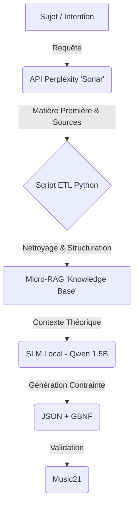

# Architecture RAG Hybride : Perplexity + SLM Local

> **Concept Clé** : Utiliser un "Gros Cerveau Connecté" (Perplexity) pour nourrir un "Petit Cerveau Rapide" (SLM Local) via un pipeline de données structurées.

## 1. Le Problème
Nous voulons générer de la musique (JSON/MIDI) localement avec un *Small Language Model* (SLM type Qwen 2.5 1.5B ou 3B).
Cependant, ces petits modèles ont deux défauts majeurs :
1.  **Manque de Culture** : Ils connaissent moins la théorie musicale pointue qu'un GPT-4.
2.  **Mimétisme** : Si on leur donne des exemples de JSON, ils tendent à les recopier bêtement au lieu de créer.
3.  **Isolation** : Ils ne connaissent pas les tendances actuelles ou les faits récents.

## 2. La Solution : Le Pipeline ETL "Intelligent"

Au lieu de scraper le web nous-mêmes (lourd et sale), nous utilisons l'API Perplexity comme un **Agent de Prétraitement de Données**.

### Le Flux de Données (Workflow)

## 3. Détail des Composants

### A. La Source : Perplexity API (Sonar)
*   **Rôle** : Chercheur senior.
*   **Fonction** : Récupère des informations synthétiques, vérifiées et sourcées sur le web.
*   **Exemple de Prompt** : *"Explique-moi la structure rythmique d'une ligne de basse Funk, sans code, en te concentrant sur les temps forts et les syncopes."*
*   **Coût** : Très faible (~3€ pour des milliers de requêtes).

### B. Le "Bibliothécaire" : Script Python (ETL)
*   **Rôle** : Organisateur.
*   **Input** : Texte brut de Perplexity.
*   **Traitement** :
    *   Découpage par sous-sections (Chunking intelligent).
    *   Ajout de métadonnées (YAML Frontmatter : Tags, Date, Source).
    *   Stockage dans la structure de dossiers du [Micro-RAG](./02_micro_rag.md).
*   **Output** : Fichiers Markdown propres (Snippets).

### C. L'Exécutant : SLM Local (Qwen 1.5B/3B)
*   **Rôle** : Technicien rapide.
*   **Stratégie Anti-Mimétisme** :
    *   On ne lui donne **PAS** d'exemples de mélodies JSON complètes dans le prompt.
    *   On lui donne des **Règles Théoriques** (issues du Micro-RAG).
    *   **Instruction** : *"Voici les règles théoriques du Funk (Snippet RAG). Traduis ces règles en une séquence de notes JSON."*
*   **Contrainte** : Utilisation de **GBNF** pour forcer une syntaxe JSON stricte valide.

### D. Le Juge : Music21
*   **Rôle** : Validateur qualité.
*   **Action** : Analyse le JSON généré. Si harmoniquement faux ou rythmiquement invalide -> Rejet et régénération (rapide car SLM local).

## 4. Avantages de cette Architecture
1.  **Qualité des Données** : Le RAG n'est pas pollué par du HTML sale. Il ne contient que des synthèses de haute qualité générées par un modèle 70B+.
2.  **Créativité Forcée** : Le SLM est obligé de "traduire" le concept (Texte) en structure (JSON), ce qui génère naturellement des variations au lieu de copier.
3.  **Coût & Performance** :
    *   Recherche : Déportée sur le Cloud (Pas de charge locale).
    *   Génération : Locale et instantanée (Pas de coût par token généré).

## 5. Le "Pont Sémantique" (Moods -> Théorie)
*Le problème du "Fossé Sémantique" : Les utilisateurs parlent en émotions ("Triste", "Épique", "Zelda"), la machine parle en théorie ("Mineur Harmonique", "Staccato").*

Pour combler ce fossé sans base vectorielle complexe, nous ajoutons une étape de **Traduction** via des fiches `moods/` :
1.  **Input** : "Musique de combat Japonais".
2.  **Lookup** : Le système cherche `moods/combat_japonais.md`.
    *   *Si absent* : Appel Perplexity -> "Quelles sont les caractéristiques théoriques d'une musique de combat traditionnelle japonaise ?" -> Crée la fiche.
3.  **Contenu de la fiche** : *"Gamme Pentatonique Hirajoshi, Taiko ignorés (Percussions lourdes), Tempo rapide (140+), Flûte Shakuhachi."*
4.  **Mapping** : Le script charge ensuite les fiches techniques correspondantes dans `theory/` et `instruments/`.

## 6. Exemple Concret
1.  **User** : Veut une "Basse Funk".
2.  **Python** : Cherche "Basse Funk" dans le Micro-RAG.
    *   *Si absent* : Appelle Perplexity -> Crée la fiche "Basse Funk" -> L'ajoute au RAG.
3.  **Prompt System** : *"Tu es un compositeur. Utilise cette règle : 'En funk, accentuer le 1er temps, éviter le 3ème...'."*
4.  **Qwen 1.5B** : Génère `{ "notes": [ {"p": "C2", "d": "1/4"}, ... ] }`
5.  **App** : Joue la mélodie.
